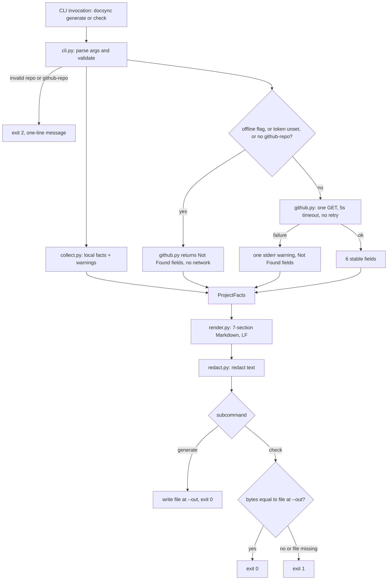

# Architecture — DS-1 Automated Documentation Sync

| Field | Value |
|---|---|
| Artifact | docs/02-architecture.md |
| SDLC Step | 2 — Architecture |
| Source documents | docs/01-requirements.md, input/DS-1-user-story.md, CLAUDE.md |
| Author | solution-architect |
| Date | 2026-10-07 |
| Status | Draft |

## 1. Design Goals

| # | Goal | Derived from | Design consequence |
|---|---|---|---|
| G-1 | Offline run finishes in under 1 s | NFR-1 | Only local file reads and static parsing (`tomllib`, `ast`); tests are never executed |
| G-2 | Online run finishes in under 5 s | NFR-2 | One single GitHub request, 5 s timeout, no retries |
| G-3 | At least 85% line coverage, every EC has a named test | NFR-3, NFR-4 | Pure functions, small components, injectable HTTP session |
| G-4 | Runtime deps limited to stdlib plus `requests` | NFR-5 | `tomllib`, `argparse`, `ast`, `pathlib`; `requests` used only in `github.py` |
| G-5 | `ruff check .` clean | NFR-6 | Type hints, no bare `except`, domain errors in `errors.py` |
| G-6 | No real network in tests | NFR-7 | `github.py` takes an injectable session; tests pass a fake |
| G-7 | Byte-identical repeat output | NFR-8 | Sorted collections, LF newlines, UTF-8, no volatile values, no absolute paths in output |
| G-8 | CI safe: no prompts, exit codes only 0/1/2 | NFR-9 | No `input()`; single top-level handler maps every failure to an exit code |
| G-9 | No secret-looking value in output | NFR-10 | Exactly one redaction function on the only two output paths (file and console) |

## 2. Component Overview

Seven components, all under `src/docsync/`. Rule: collectors never render; the renderer never fetches.

| Component | File | Responsibility | Depends on | Satisfies (FR IDs) |
|---|---|---|---|---|
| C-1 Errors | `errors.py` | Domain exceptions: `DocsyncError` (base), `UsageError` (exit 2), `CollectError`, `GitHubError` | none | FR-19 |
| C-2 Model | `model.py` | `Field`, `ProjectFacts`, `NOT_FOUND` sentinel; no logic beyond construction | none | FR-3, FR-13 |
| C-3 Redactor | `redact.py` | `redact(text) -> str`, the only redaction function | none | FR-6, FR-20 |
| C-4 Local collector | `collect.py` | Read `pyproject.toml`, scan source and test trees statically, return local facts plus warnings; never opens `.env` | C-1, C-2 | FR-3, FR-7, FR-13, FR-14 |
| C-5 GitHub client | `github.py` | Decide offline vs online, one GET to `/repos/{owner}/{name}`, extract the 6 stable fields, degrade to `Not Found` on any failure | C-1, C-2 | FR-4, FR-8, FR-9, FR-10, FR-11, FR-12 |
| C-6 Renderer | `render.py` | Pure function `ProjectFacts -> str`; emits exactly 7 sections in fixed order, LF line endings | C-2 | FR-2, FR-3, FR-5, FR-17 |
| C-7 CLI | `cli.py` (+ `__main__.py`, `__init__.py` holding `__version__`) | argparse, validation, orchestration of C-4, C-5, C-6, redaction, file write, `check` comparison, exit codes, verbose diagnostics | C-1 to C-6 | FR-1, FR-15, FR-16, FR-17, FR-18, FR-19, FR-20 |

FR coverage check (every FR appears in at least one row): FR-1 C-7; FR-2 C-6; FR-3 C-2/C-4/C-6; FR-4 C-5; FR-5 C-6; FR-6 C-3; FR-7 C-4; FR-8 C-5; FR-9 C-5; FR-10 C-5; FR-11 C-5; FR-12 C-5; FR-13 C-2/C-4; FR-14 C-4; FR-15 C-7; FR-16 C-7; FR-17 C-6/C-7; FR-18 C-7; FR-19 C-1/C-7; FR-20 C-3/C-7. **Unmapped FRs: none.**

Note on FR-6: C-3 provides the function; C-7 is the single place that calls it (file write, `check` comparison input, stdout, stderr). No other module prints or writes.

## 3. Data Flow



Narrative:

1. `cli.py` parses flags (FR-18). It validates `--repo` is an existing directory (EC-10) and `--github-repo` matches `OWNER/NAME` (EC-11); on failure it raises `UsageError`, prints one redacted line and exits 2.
2. `cli.py` calls `collect.collect(repo)`; it returns local facts and a list of warning strings (EC-6, EC-7, EC-8, EC-13).
3. `cli.py` calls `github.fetch(github_repo, offline, token, session)`. The token is read from `os.environ["DOCSYNC_GITHUB_TOKEN"]` in `cli.py` only to pass on; only its set/unset state is ever logged. Offline conditions: `--offline` (wins, A-5), token unset (EC-5), `--github-repo` omitted (EC-14). Each yields all six hosted fields as `Not Found` with zero requests.
4. Online: one GET with `Authorization: Bearer <token>` and `timeout=5`; no retry. Timeout, 404, 403, bad JSON each produce exactly one warning and `Not Found` fields (EC-1 to EC-4).
5. `cli.py` assembles `ProjectFacts` and calls `render.render(facts)`, which returns the 7-section string with LF endings.
6. `cli.py` passes the string through `redact.redact`. Warnings and verbose diagnostics go to stderr through the same function.
7. `generate`: write the redacted text as UTF-8 bytes (no newline translation), creating parent dirs. `check`: encode identically and compare to the bytes at `--out`; missing file is drift (EC-12, A-4). `check` never writes (FR-16).
8. Exit 0 on success or in-sync, 1 on drift, 2 on usage or unexpected error.

Content decisions for sections (resolves A-1 proposal; derived only from repository files):

| Section | Source |
|---|---|
| 1 Project Overview | `[project].name`, `[project].description` |
| 2 Identity & Metadata | `[project]` keys `version`, `requires-python`, `license`, `authors` (names only); each missing key is `Not Found` |
| 3 Hosted Repository Metadata | The 6 FR-4 fields, from C-5 |
| 4 Modules & Entry Points | Sorted `.py` module paths (relative, POSIX separators) under `src/` if present, else the repo root excluding tests and hidden dirs; `[project.scripts]` entries |
| 5 Dependencies | Sorted `[project].dependencies`; sorted `[project.optional-dependencies]` groups |
| 6 Test Suite Summary | Static: count of `test_*.py` files and of `test_*` functions under `tests/` via `ast`; tests are not run |
| 7 Generation Info | `docsync.__version__` and schema version constant only (FR-5) |

## 4. Data Model

```python
NOT_FOUND = "Not Found"          # sole sentinel, exact spelling (FR-3)

@dataclass(frozen=True)
class Field:
    value: str | tuple[str, ...]  # scalar or ordered list
    # Field(NOT_FOUND) is the canonical unresolved value

@dataclass(frozen=True)
class ProjectFacts:
    overview: dict[str, Field]        # name, description
    identity: dict[str, Field]        # version, requires_python, license, authors
    hosted: dict[str, Field]          # full_name, description, default_branch, visibility, license, topics
    modules: tuple[str, ...]          # sorted; empty tuple renders as Not Found
    entry_points: tuple[str, ...]     # sorted "name = target"; empty renders as Not Found
    dependencies: tuple[str, ...]     # sorted; empty renders as Not Found
    optional_dependencies: dict[str, tuple[str, ...]]
    tests: dict[str, Field]           # test_files, test_functions
    warnings: tuple[str, ...]         # emitted by cli to stderr, never rendered
```

Rules: the dict keys are fixed so every field is always present (FR-3); renderers emit `Not Found` for `NOT_FOUND` or empty collections; the `hosted` dict has exactly the six FR-4 keys and nothing else; no timestamp or hash field exists in the model (FR-5). Tool version and schema version come from constants, values `Not Found` here per A-7 (defined at implementation).

## 5. Technology Choices

| Decision | Chosen | Rejected alternative | Rationale |
|---|---|---|---|
| CLI parsing | `argparse` (stdlib) | `click` / `typer` | NFR-5 forbids extra runtime deps; two subcommands are trivial. Override `error()` to exit 2 with no traceback (FR-19) |
| HTTP | `requests` with injectable session | `urllib.request`; `httpx` | `requests` is the single permitted dependency (NFR-5); simple `timeout=`; session is easy to fake |
| TOML parsing | `tomllib` (3.11 stdlib) | `tomli`, `toml` | Python 3.11+ guaranteed (NFR-5); no dependency |
| Test summary | Static `ast` parse | Run `pytest --collect-only` | Running pytest is slow (NFR-1), nondeterministic, and executes repo code |
| Data model | frozen `dataclass` | `pydantic`; plain dicts | No dependency; immutability supports determinism |
| Templating | Plain Python string building | Jinja2 | Extra dependency; 7 fixed sections |
| Redaction | Regex-based single function | Per-collector sanitising | One choke point is auditable (FR-6) |
| Repo inference | Explicit `--github-repo` only | Parse `git remote` | A-2: avoids running git, reading `.git/config` (may embed credentials) and nondeterminism |
| Test fakes | `monkeypatch` / fake session object | `responses`, `requests-mock` | Test-only deps would need approval; fake is about 15 lines |

## 6. Error Handling Strategy

| EC | Handled by | Behaviour |
|---|---|---|
| EC-1 API timeout | C-5 `github.py` catches `requests.Timeout` | One stderr warning, six hosted fields `Not Found`, exit 0 |
| EC-2 API 404 | C-5 | Same as EC-1 |
| EC-3 API 403 rate limit | C-5 (non-2xx status check) | Same as EC-1 |
| EC-4 Malformed JSON | C-5 catches `ValueError` from `.json()`, and non-dict payloads | Same as EC-1 |
| EC-5 Token unset | C-5 (`token is None` branch) | Offline, no session call, hosted `Not Found`, exit 0; only "token: not set" shown in verbose |
| EC-6 Empty repository | C-4 returns all-default facts; C-6 renders all 7 sections | Full document, unresolved fields `Not Found`, exit 0 |
| EC-7 Missing `pyproject.toml` | C-4 (`FileNotFoundError` caught) | Dependent fields `Not Found`, no warning needed, exit 0 |
| EC-8 Unreadable file | C-4 catches `OSError`/`UnicodeDecodeError` per file | Affected field `Not Found`, one warning appended to `warnings`, continue |
| EC-9 Secret-looking value | C-3 `redact`, invoked by C-7 on all output | Value replaced by fixed placeholder in file and console |
| EC-10 Bad `--repo` | C-7 validation raises `UsageError` | One-line stderr message, exit 2 |
| EC-11 Bad `--github-repo` | C-7 validation raises `UsageError` | One-line stderr message, exit 2 |
| EC-12 `check` with missing file | C-7 | Treated as drift, exit 1 |
| EC-13 Malformed `pyproject.toml` | C-4 catches `tomllib.TOMLDecodeError` | Dependent fields `Not Found`, one warning, continue |
| EC-14 `--github-repo` omitted | C-5 (`github_repo is None` branch) | Hosted `Not Found`, no network call |

Catch-all: `cli.main` wraps execution in `except DocsyncError` (exit 2, message) and a final `except Exception` (exit 2, one-line generic message, traceback shown only under no circumstances; verbose prints the exception type name only). This is not a bare `except:` and satisfies FR-19. Write failures at `--out` (permissions) are `OSError` mapped to exit 2.

## 7. Security Design

| Concern | Design |
|---|---|
| Redaction | `redact.redact(text)` replaces patterns for GitHub tokens (`ghp_`, `gho_`, `github_pat_` prefixes), `Bearer <value>`, `key=value` pairs whose key contains token/secret/password/key/credential, and the literal current value of `DOCSYNC_GITHUB_TOKEN` if set. Called only from `cli.py` immediately before every write, comparison, `print` and stderr emit (FR-6, FR-20, NFR-10) |
| Env-var-only config | The token is read only from `DOCSYNC_GITHUB_TOKEN` via `os.environ`; there is no config file or CLI flag for it (FR-8) |
| No `.env` reads | `collect.py` reads only `pyproject.toml`, `.py` files under source/test dirs; it never opens dotfiles. A test patches `open`/`Path.read_text` to assert `.env` is never touched (FR-7) |
| No token in output or logs | The token is passed only into the `Authorization` header inside `github.py`; logging reports "set" or "not set" only; exception messages from `requests` are not echoed (they can include URLs/headers), only a fixed per-failure-class text is used (FR-8) |
| Verbose mode | Same redaction applies (FR-20) |
| No `.git` access | Remote URLs (which may embed credentials) are never read (see Section 5) |
| Absolute paths | Not written to the document (also determinism) |

## 8. Testing Strategy

| Level | Scope | Approach |
|---|---|---|
| Unit | `redact.py` (EC-9, NFR-10), `render.py` (FR-2, FR-3, FR-5, FR-17; pure, fed hand-built `ProjectFacts`), `collect.py` (EC-6, EC-7, EC-8, EC-13, FR-7) using `tmp_path` fixture repos, `github.py` (EC-1 to EC-5, EC-14, FR-8, FR-12) | Arrange-Act-Assert; each EC test name contains its EC id (NFR-4) |
| Integration | `cli.main(argv)` end to end on `tmp_path` repos: generate/check exit codes, no-write on check, double-run byte identity, flags/defaults, exit 2 with no traceback, offline makes no requests, verbose redaction (FR-1, FR-13 to FR-20) | Call `main()` in-process and assert on return code, `capsys`, file bytes |
| Performance | `test_offline_under_1s` on a small fixture repo (size: Not Found, A-3) | `time.perf_counter` |

GitHub API faking: `github.fetch` accepts a `session` parameter (default `requests.Session()`). Tests inject a `FakeSession` whose `get(url, headers, timeout)` records the call and returns a canned response, or raises `requests.Timeout`, or returns status 404/403 or an invalid-JSON body. Assertions: timeout argument equals 5, exactly one call, bearer header present, no call when offline. An autouse fixture also monkeypatches `requests.Session.request` to raise, so any accidental real call fails the suite (NFR-7). Coverage: `pytest --cov=src/docsync --cov-fail-under=85` (NFR-3).

## 9. Interface Contract

```text
docsync generate [--repo PATH] [--out PATH] [--github-repo OWNER/NAME] [--offline] [--verbose]
docsync check    [--repo PATH] [--out PATH] [--github-repo OWNER/NAME] [--offline] [--verbose]
```

| Flag | Default | Meaning |
|---|---|---|
| `--repo PATH` | `.` | Repository root to document; must be an existing directory |
| `--out PATH` | `docs/PROJECT_DOCS.md` | Output file (generate) or committed file to compare (check); a relative `--out` is resolved against the current working directory |
| `--github-repo OWNER/NAME` | none | Enables hosted metadata; omitted means hosted fields `Not Found` |
| `--offline` | off | No network calls, even if the token is set |
| `--verbose` | off | Extra diagnostics on stderr (redacted) |

Environment: `DOCSYNC_GITHUB_TOKEN` (optional). Invocation: `docsync` console script and `python -m docsync`. No prompts. A missing subcommand is a usage error.

| Exit code | Meaning |
|---|---|
| 0 | `generate` succeeded, or `check` found the file in sync (including degraded runs with warnings) |
| 1 | `check` detected drift (including missing file) |
| 2 | Invalid input or usage error, write failure, or unexpected internal error; never a traceback |

stdout: short result line (for example "wrote <path>" or "in sync"/"drift detected"); stderr: warnings and verbose diagnostics. All output is redacted.

## 10. Open Questions

| # | Question | Needed for | Default if not answered |
|---|---|---|---|
| OQ-1 | Confirm the section content mapping in Section 3 (A-1): Test Suite Summary is static counts, not a test run | Step 3 design review | As proposed |
| OQ-2 | Confirm `--github-repo` is never inferred from git remotes (A-2) | Step 3 | No inference |
| OQ-3 | Should the module scan skip a configurable directory list, or only hidden dirs, `tests`, `__pycache__`, `venv`, `.venv`? Exact list not specified | Step 3 | Fixed built-in skip list |
| OQ-4 | Tool version and schema version values (A-7): proposed source is `docsync.__version__` matching `pyproject.toml`; values `Not Found` until implementation | Step 4 | Defined in impl plan |
| OQ-5 | Repository size for NFR-1 measurement (A-3) | Step 3 | `Not Found`; use a small fixture |
| OQ-6 | Whether `check` should print a diff summary on drift (not in requirements; omitted to keep scope small) | Step 3 | No diff output |
| OQ-7 | Does `--out` relative path resolve against cwd or `--repo`? Proposed: cwd | Step 3 | cwd |

---
**Gate:** Approve step 2 and continue? (yes / changes needed)
